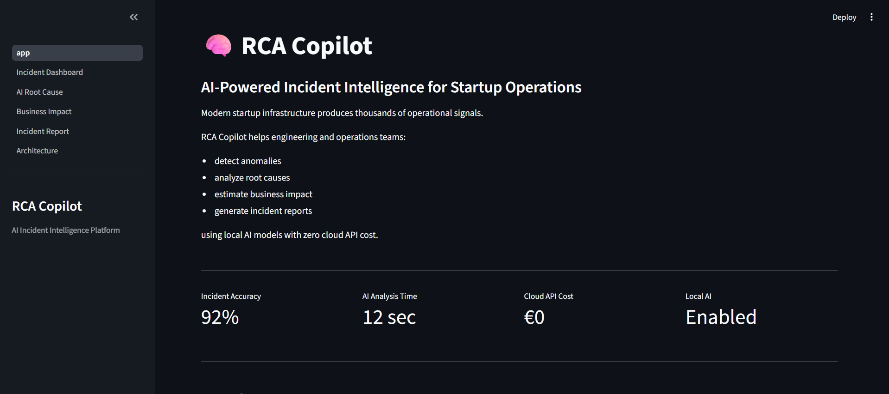
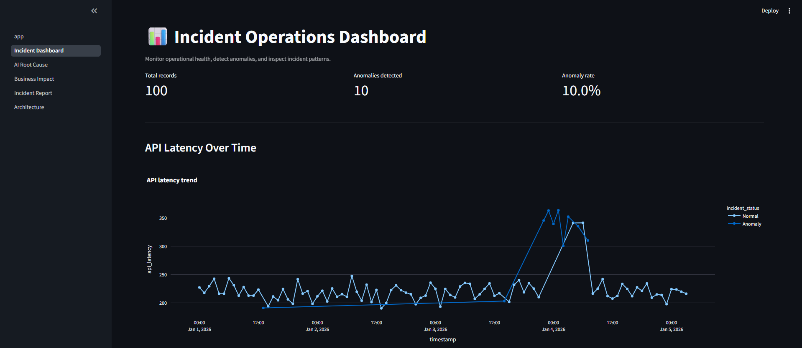
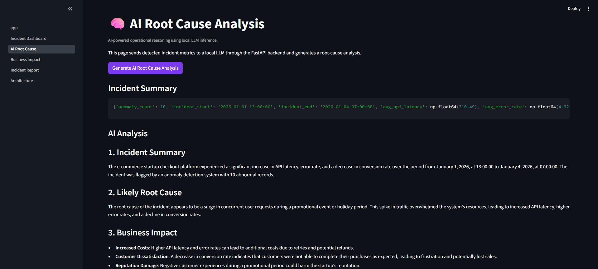
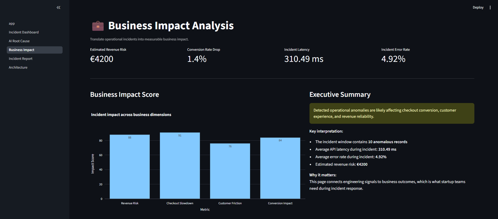
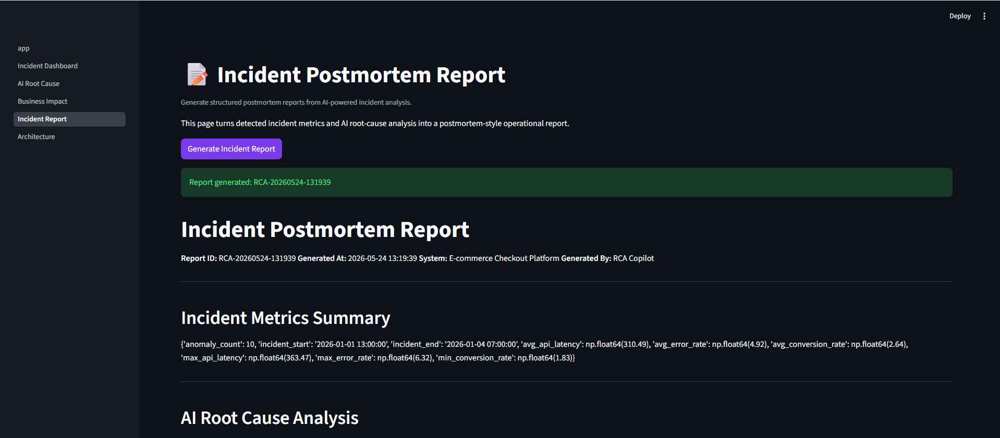
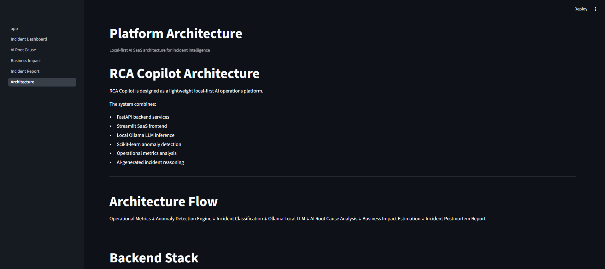

# 🧠 RCA Copilot

AI-powered incident intelligence platform for startup operations teams.

RCA Copilot detects operational anomalies, generates AI root-cause analysis, estimates business impact, and creates incident postmortem reports using local AI models with zero cloud inference cost.

---

# 🚀 Features

## 📊 Incident Operations Dashboard
- Real-time-style operational metrics
- API latency monitoring
- Error-rate tracking
- Conversion-impact analysis
- Anomaly visualization

## 🧠 AI Root Cause Analysis
- Local LLM-powered incident reasoning
- AI-generated operational summaries
- Recommended remediation actions
- Startup-focused operational intelligence

## 💼 Business Impact Analysis
- Revenue-risk estimation
- Customer-impact analysis
- Operational KPI interpretation
- Executive-style incident visibility

## 📝 AI Incident Reports
- AI-generated postmortem reports
- Downloadable markdown reports
- Structured operational summaries

## 🏗️ Local-First Architecture
- Ollama local inference
- Zero cloud API cost
- Offline AI capability
- Privacy-friendly deployment

---

# 🧱 Architecture

Operational Metrics
↓
Anomaly Detection Engine
↓
Incident Classification
↓
Local LLM Inference (Ollama)
↓
AI Root Cause Analysis
↓
Business Impact Estimation
↓
Incident Postmortem Report

---

# ⚙️ Tech Stack

## Backend
- FastAPI
- Python
- Scikit-learn
- Pandas

## Frontend
- Streamlit
- Plotly

## AI Layer
- Ollama
- qwen2.5-coder:7b

## Infrastructure
- Docker
- Docker Compose

---

# 🖥️ Local Development

## Clone repository

```bash
git clone <your-repo-url>
cd rca-copilot
```

## Create virtual environment

```bash
python -m venv .venv
```

## Activate environment

### Windows

```bash
.\.venv\Scripts\Activate.ps1
```

### Mac/Linux

```bash
source .venv/bin/activate
```

## Install dependencies

```bash
pip install -r requirements.txt
```

---

# 🤖 Install Ollama

Download Ollama:

https://ollama.com

Pull local model:

```bash
ollama pull qwen2.5-coder:7b
```

---

# ▶️ Run Backend

```bash
uvicorn backend.main:app --reload
```

Backend URL:

```txt
http://127.0.0.1:8000
```

---

# ▶️ Run Frontend

```bash
streamlit run frontend/app.py
```

Frontend URL:

```txt
http://localhost:8501
```

---

# 🐳 Docker Setup

Build containers:

```bash
docker compose build
```

Run containers:

```bash
docker compose up
```

---

# 📌 Product Vision

RCA Copilot explores how local AI systems can help startup infrastructure teams:
- detect operational incidents
- accelerate debugging
- understand business impact
- improve operational visibility
- reduce incident-response time

---

# 📷 Screenshots

## Home



## Incident Operations Dashboard



## AI Root Cause Analysis



## Business Impact Analysis



## Incident Postmortem Report



## Architecture



---

# 👨‍💻 Author

Built by Neha Parepalli

AI Engineering · Data Engineering · Startup Operations Intelligence